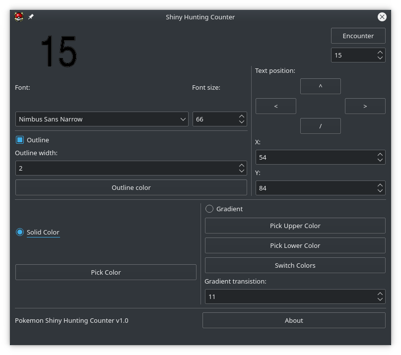

# Pokemon Shiny Hunting Counter
This is an application for keeping track of wild encounters while Shiny Pokemon Hunting.



## Build
Either open the .pro file with Qt Creator, or:
```
mkdir Build
cd Build
qmake ..
make
```

## Usage
Once you've configured the text the way you like it, click the encounter button, and when there is a blue highlight around it, press space to increment the counter.

## Todo
 - Render counter to second window
 - Add commas to counter
 - Show colors
 - Pattern option